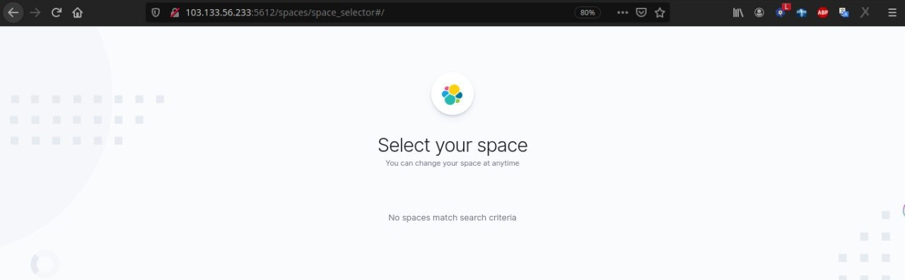
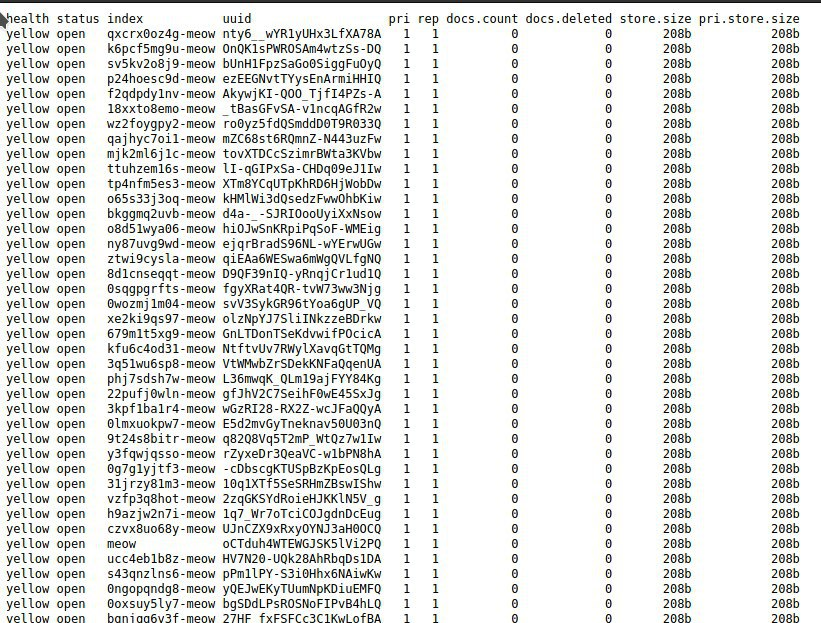
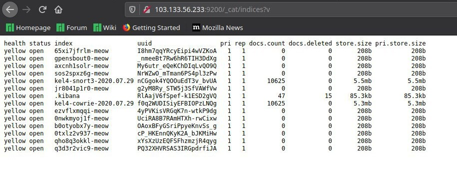

Catatan
===========

Dalam pengerjaan projek ELK Stack ini, kami menemukan beberapa kendala yang mempengaruhi, sehingga dalam hasil dokumentasi kurang detail dan maksimal. 

Kendala-kendala tersebut adalah sebagai berikut.

Meow Attack
-----------

Tanggal 25 Juli 2020, kami mencoba mengakses dashboard Kibana tetapi tidak dapat diakses seperti pada gambar berikut

Kami mencoba untuk me-restart layanan yang berhubungan dengan hal tersebut, dashboard bisa diakses kembali, tetapi untuk database dari elasticsearch hilang. Index Pattern yang sebelumnya sudah dibuat tiba-tiba hilang yang menyebabkan visualisasi dashboard tidak dapat dilakukan, juga pada halaman Discover data-data dari semua log tidak bisa ditampilkan.

Setelah itu kami mencoba untuk mencari tau mengapa hal tersebut terjadi, dengan mengakses elasticsearch di browser.

.. code-block:: shell

    URL :103.133.56.233:9200/_cat/indices?v

Kemudian memunculkan daftar index yang ada seperti pada gambar berikut.

Dari gambar tersebut terdapat keanehan dimana terdapat index yang tidak ada sebelumnya dan mencurigakan. Index tersebut selalu berakhiran "-meow" dalam penamaannya. Ternyata setelah dicari tau penyebabnya. ELK stack kami telah terkena Meow Attack. 

Serangan ini menyerang database yang tidak terlindungi untuk elasticsearch dan MonggoDB. Hacker menggunakan bot untuk menghapus semua database dan meninggalkan jejak dengan akhiran kata "-meow". Database dihapus tanpa peringatan, tidak seperti serangan hacker yang meyabotase database dan biasanya meminta uang tebusan, tetapi serangan ini hanya sekedar iseng belaka tanpa kita ketahui motivasi dibalik serangan tersebut.

Serangan ini 2 kali menyerang ELK Stack kami, untuk yang kedua setelah diinstall ulang untuk ELK Stack lalu ditambahkan fitur X-Pack untuk antisipasi. Serangan yang kedua terjadi lagi pada tanggal 29 Juli 2020. Saat sedang mengkonfigurasi keamanan login dari X-Pack dimana kami mematikan sesaat fitur dan sedang melakukan pembuatan visualisasi untuk dashboard tiba-tiba saja terjadi serangan itu lagi, karena dirasa pengumpulan projek sudah mendekati hari H, kami memutuskan untuk serangan terakhir tersebut tidak dilakukan upaya penanggulangan seperti install ulang.

Mitigasi
~~~~~~~~

Tindakan yang kami ketahui saat ini adalah dengan menambahkan fitur keamanan yang kuat di server VPS supaya hacker tidak bisa menyusupi kembali dengan bot yang mereka sebar di internet. Untuk fitur keamanan yang dapat ditambahkan di fitur ELK Stack adalah dengan set up username dan password menggunakan X-Pack.

Untuk tindakan mitigasi lainnya yang lebih efektif masih belum bisa kami ketahui, dikarenakan Meow Attack ini yang baru muncul akhir Juli 2020 dan belum ada yang membahas terutama setelah terjadi serangan atau penanggulangan serangan tersebut.

Saran Pengerjaan Projek ELK Stack
---------------------------------

Pengerjaan projek agar maksimal dan tidak terjadi kendala dari eksternal maupun internal. 

Hal pertama saat sebelum melakukan instalasi adalah pastikan space storage atau RAM server mumpuni untuk menginstall tools atau software yang diperlukan, kemudian karena tujuannya adalah menyimpan data log yang sangat banyak untuk divisualisasikan.

Kemudian setelah selesai melakukan instalasi ELK Stack, tambahkan fitur keamanan X-Pack yang lisensinya tersedia saat mengaktifkan trial version. Hal ini wajib dilakukan karena belum diketahui tindakan penanggulangan yang terjadi terhadap Meow Attack yang menjadi keleamahan database yang tidak ada fitur keamanan terutama pada elasticsearch dan MonggoDB.
