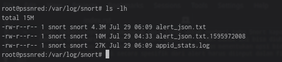
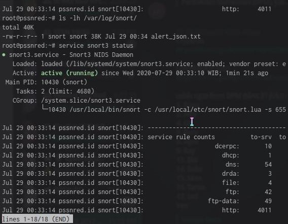
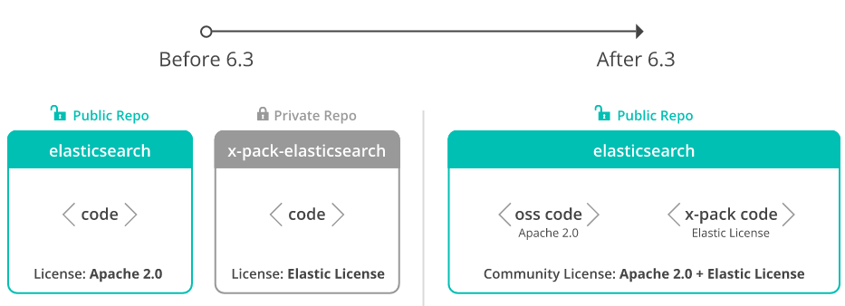
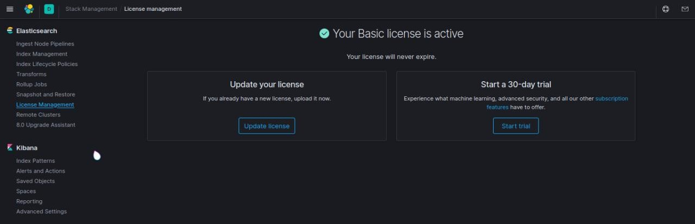
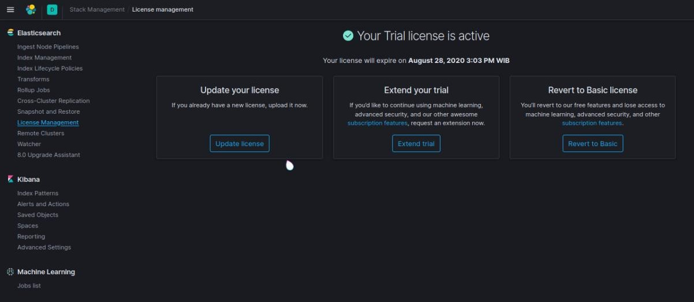
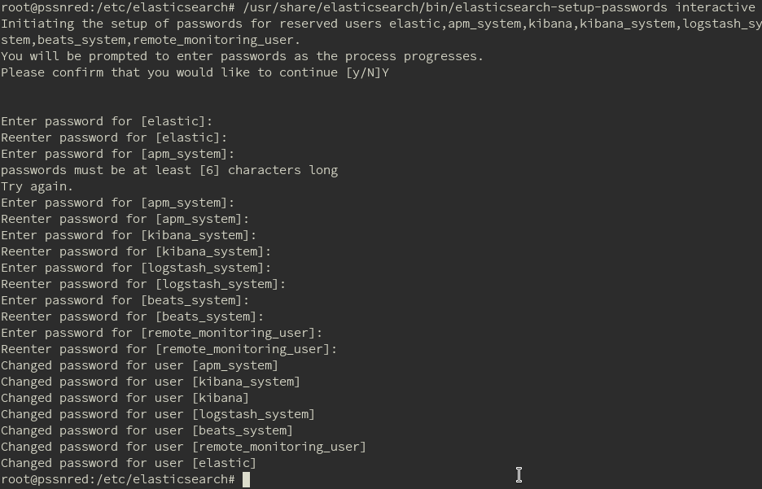
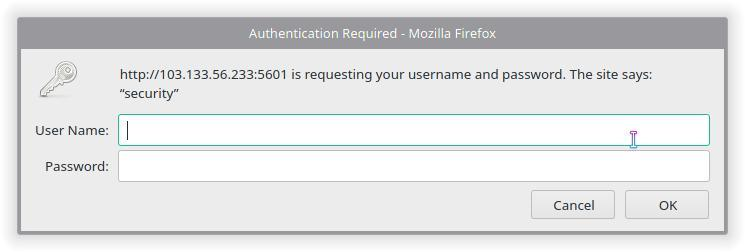

Pengembangan
=============

ELK merupakan tumpukan yang terdiri dari tiga software: Elasticsearch, Logstash dan Kibana. Dengan kemampuan dari ketiga software yang digabungkan menjadi satu kesatuan, ELK Stack dapat digunakan untuk pencarian, pemrosesan data, agregasi, dan visualisasi. 

Tidak hanya sebatas dengan kemampuan tersebut, dimana tujuannya adalah memvisualisasikan banyak data yang diperoleh agar human-readable. ELK Stack dapat dikembangakan dengan menambahkan konfigurasi atau diintegrasikan dengan software yang mendukung. Seperti dalam projek ini kami menambahkan & mengintegrasikan Cowrie, kemudian Snort ditambah pengamanan yang didapat dari X-pack 

Snort 3
-------

Snort adalah tools open-source untuk Network-Based Intrusion Detection System (NIDS) yang memiliki fitur untk sniff lalu lintas jaringan dan melakukan monitoring paket data yang masuk dan keluar dari jaringan kllien ke server atau sebaliknya. Fitur yang digunakan adalah fungsi snort untuk analisa setiap paket dari aktivitas malicious yang berjalan melalui jaringan.
Seluruh instalasi snort dilakukan pada direktori ~/Kelompok_4/snort_src/ ,  instalasi berdasarkan refrensi dari Noah Dietrich dalam bukunya Snort 3 on Ubuntu.

Snort banyak membutuhkan dependencies agar dapat berjalan sesuai dengan fungsinya

Gperftools
~~~~~~~~~~

unduh dan install gperftools 2.7. tcmalloc adalah memory allocator untuk optimisasi concurrency tinggi dan menyediakan kecepatan cepat untuk penukaran penggunaan memory

.. code-block:: shell

  sudo apt-get install -y build-essential autotools-dev libdumbnet-dev \ libluajit-5.1-dev libpcap-dev zlib1g-dev pkg-config libhwloc-dev \cmake 
  sudo apt-get install -y liblzma-dev openssl libssl-dev cpputest \libsqlite3-dev uuid-dev 

Snort DAQ (Data Acquisition Library) memiliki beberapa kebutuhan untuk dapat berjalan

.. code-block:: shell

  sudo apt-get install -y bison flex libcmocka-d

lakukan build dan instalasi dari gperftools

.. code-block:: shell

  sudo apt install -y libundwind-dev
  cd ~/snort_src
  wget https://github.com/gperftools/gperftools/releases/download/gperftools-2.7.90/gperftools-2.7.90.tar.gz
  tar xzvf gperftools-2.7.90.tar.gz
  cd gperftools-2.7.90
  ./configure
  make
  sudo make install

Hyperscan
~~~~~~~~~

Snort 3 menggunakan hyperscan untuk menyamakan pattern dengan cepat, Hyperscan membutuhkan Ragel dan  Boost Header. Kegunaan Boost adalah untuk libraries C++ untuk Hyperscan. 

.. code-block:: shell

  wget https://dl.bintray.com/boostorg/release/1.72.0/source/boost_1_72_0.tar.gz
  tar -xvzf boost_1_72_0.tar.gz

Ragel

.. code-block:: shell

  wget http://www.colm.net/files/ragel/ragel-6.10.tar.gz
  tar -xzvf ragel-6.10.tar.gz
  cd ragel-6.10
  ./configure
  make
  sudo make install

Install hyperscan dari source langsung, dengan berada pada direktori yang sama pada Boost Header untuk digunakan librariesnya

.. code-block:: shell

  cd ~/snort_src
  wget https://github.com/intel/hyperscan/archive/v5.2.1.tar.gz
  tar -xvzf v5.2.1.tar.gz
  mkdir ~/snort_src/hyperscan-5.2.1-build
  cd hyperscan-5.2.1-build/
  cmake-DCMAKE_INSTALL_PREFIX=/usr/local -DBOOST_ROOT=~/snort_src/boost_1_72_0/ ../hyperscan-5.2.1
  make
  sudo make install

untuk menguji apakah hyperscan sudah dapat bekerja dengan menjalankan perintah berikut pada direktorinya

.. code-block:: shell

  cd ~/snort_src/hyperscan-5.2.1-build/
  ./bin/unit-hyperscan

Flatbuffer
~~~~~~~~~~

salah satu kebutuhan dari snort adalah flatbuffer, untuk efisiensi memory serialization library.

.. code-block:: shell
  
  cd ~/snort_src
  wget https://github.com/google/flatbuffers/archive/v1.12.0.tar.gz \
  -O flatbuffers-v1.12.0.tar.gz
  tar -xzvf flatbuffers-v1.12.0.tar.gz
  mkdir flatbuffers-build
  cd flatbuffers-build
  cmake ../flatbuffers-1.12.0
  make
  sudo make install

Libdaq
~~~~~~

lakukan instalasi Data Aquisition Library (DAQ) dari website snort. Kemudian lakukan update library snortnya

.. code-block:: shell

  cd ~/snort_src
  git clone https://github.com/snort3/libdaq.git
  cd libdaq
  ./bootstrap
  ./configure
  make
  sudo make install
  sudo ldconfig

Snort3
~~~~~~

Sekarang sudah dapat untuk mengunduh, kompile dan install Snort 3 dari repository Github.

.. code-block:: shell

  cd ~/snort_src
  git clone git://github.com/snortadmin/snort3.git
  cd snort3
  ./configure_cmake.sh --prefix=/usr/local --enable-tcmalloc
  cd build
  make
  sudo make install

langkah terakhir dalam tahap instalasi Snort adalah untuk verifikasi bahwa Snort terinstall dan dapat berjalan.

.. code-block:: shell

  /usr/local/bin/snort -V
 
maka akan terlihat output sebagai berikut

.. code-block:: shell

  ,,_ 		-*> Snort++ <*
  o" )~ 	Version 3.0.1 (Build 2)
  '''' 		By Martin Roesch & The Snort Team
  		http://snort.org/contact#team
  		Copyright (C) 2014-2020 Cisco and/or its affiliates. Allrights reserved.
  		Copyright (C) 1998-2013 Sourcefire, Inc., et al.
  		Using DAQ version 3.0.0
  		Using LuaJIT version 2.1.0-beta3
  		Using OpenSSL 1.1.1f 31 Mar 2020
  		Using libpcap version 1.9.1 (with TPACKET_V3)
  		Using PCRE version 8.43 2019-02-23
  		Using ZLIB version 1.2.11 
  		Using FlatBuffers 1.12.0
  		Using Hyperscan version 5.2.1 2020-04-25
  		Using LZMA version 5.2.4

Jika output terlihat seperti pada gambar maka Snort sudah terinstall dan bekerja. Selanjutnya uji Snort dengan file konfigurasi defaultnya.

.. code-block:: shell

  snort -c /usr/local/etc/snort/snort.lua

.. code-block:: shell

  Snort successfully validated the configuration (with 0 warnings).
  o")~ Snort exiting

Menambahkan Rules  
~~~~~~~~~~~~~~~~~ 
Sebelumnya kita buat direktori untuk menyimpan log snort yang nantinya akan berguna untuk ELK Stack

.. code-block:: shell

    sudo mkdir /var/log/snort

Pembuatan rules dapat kita lakukan sendiri, dengan membuat sendiri local rules atau menambahkan rules yang ada dari internet.

Untuk membuat local rules bisa dilakukan dengan cara sebagai berikut.

.. code-block:: shell

   sudo mkdir /usr/local/etc/rules
   sudo touch /usr/local/etc/rules/local.rules
   sudo vi /usr/local/etc/rules/local.rules

Isikan rules yang kita inginkan dalam hal ini kami memberikan rules untuk pendeteksian protokol ICMP.

.. code-block:: shell
    
    alert icmp any any -> any any (msg:"ICMP Traffic Detected";sid:10000002;)

Kemudian jalankan snort untuk memuat rules yang telah dibuat.

.. code-block:: shell

   snort -c /usr/local/etc/snort/snort.lua \
   -R /usr/local/etc/rules/local.rules

Untuk menambahkan rules dari internet kita dapat melakukan dengan cara sebagai berikut.

Pertama-tama buat folder built_rules, folder ini berisi referensi dan info untuk rules bawaan

.. code-block:: shell
    
    sudo mkdir /usr/local/etc/builtin_rules

Kemudian download rules dari internet. Untuk rules ini kami peroleh dari website resmi Snort dengan nama file snortrules-3000

.. code-block:: shell

     cd ~/snort_src/
     mkdir snortrules-3000
     tar -xvzf snortrules-snapshot-3000.tar.gz -C ./snortrules-3000 
     cd snortrules-3000
     sudo cp ./rules/*.rules /usr/local/etc/rules/
     sudo cp ./builtins/builtins.rules /usr/local/etc/builtin_rules/
     sudo cp ./etc/* /usr/local/etc/snort/

Ubah konfigurasi dalam file snort.lua 

.. code-block:: shell
    
    sudo vi /usr/local/etc/snort/snort.lua
    
Perubahan yang dilakukan adalah sebagai berikut.

.. code-block:: shell

    HOME_NET = '103.133.56.233'

.. code-block:: shell
    
    ips =
    { 
        -- use this to enable decoder and inspector alerts 
        enable_builtin_rules = true, 
        -- use include for rules files; be sure to set your path 
        -- note that rules files can include other rules files 
        --include = 'snort3-community.rules', 
        -- The following include syntax is only valid for ... 
        -- RULE_PATH is typically set in snort_defaults.lua 
        rules = [[ 
            include $BUILTIN_RULE_PATH/builtins.rules 
        
            include $RULE_PATH/snort3-app-detect.rules 
            include $RULE_PATH/snort3-browser-chrome.rules
        ...
    }
    
Cek file konfigurasi dan pastikan tidak ada error

.. code-block:: shell

    snort -c /usr/local/etc/snort/snort.lua \
    -R /usr/local/etc/rules/local.rules

Passing File PCAP ke Snort dan Output Alert JSON 
~~~~~~~~~~~~~~~~~~~~~~~~~~~~~~~~~~~~~~~~~~~~~~~~~~~~

File PCAP yang dapat digunakan untuk menghasilkan peringatan dari rules builtin dan rules tambahan lainnya. 

.. code-block:: shell
    
    mkdir pcaps
    cd pcaps
    wget https://download.netresec.com/pcap/maccdc-2012/maccdc2012_00000.pcap.gz
    gunzip maccdc2012_00000.pcap.gz
    wget https://download.netresec.com/pcap/maccdc-2012/maccdc2012_00001.pcap.gz
    gunzip maccdc2012_00001.pcap.gz
    
Edit file konfigurasi snort.lua 
 
.. code-block:: shell
    
    sudo vi /usr/local/etc/snort/snort.lua

Aktifkan alert JSON

.. code-block:: shell

    alert_json =
    {
        file = true,
        limit = 10,
        fields = 'seconds action class b64_data dir dst_addr \
        dst_ap dst_port eth_dst eth_len eth_src eth_type gid icmp_code \
        icmp_id icmp_seq icmp_type iface ip_id ip_len msg mpls pkt_gen \
        pkt_len pkt_num priority proto rev rule service sid src_addr \
        src_ap src_port target tcp_ack tcp_flags tcp_len tcp_seq \
        tcp_win tos ttl udp_len vlan timestamp',
    }

Pertama-tama kita menggunakan opsi file untuk mengaktifkan alert file berformat json. Selanjutnya kita tentukan opsi limit untuk memberi tahu Snort kapan harus membuat file baru, ketika file alert mencapai 10 MB. Limit ini bisa diubah sesuai keinginan dan kemampuan dari server. Kemudian menentukan opsi bidang, untuk mengidentifikasi secara spesifik dari alert harus diinput dalam file json.

Jika kita menjalankan snort dengan perintah sebagai berikut.

.. code-block:: shell

    sudo snort -c /usr/local/etc/snort/snort.lua --pcap-filter \*.pcap \
    --pcap-dir ~/pcaps -l /var/log/snort -s 65535 -k none -m 0x1b

Dilayar terminal tidak akan terjadi apa-apa, karena output alert akan dimasukkan ke dalam file json yang tersimpan di direktori log snort.

    
Membuat Snort Berjalan Startup
~~~~~~~~~~~~~~~~~~~~~~~~~~~~~~ 

Kami membuat menambahkan skrip systemd untuk menjalankan snort secara otomatis saat server menyala, dengan perintah sebagai berikut.

.. code-block:: shell

    sudo groupadd snort
    sudo useradd snort -r -s /sbin/nologin -c SNORT_IDS -g snort
    sudo rm /var/log/snort/*
    sudo chmod -R 5775 /var/log/snort
    sudo chown -R snort:snort /var/log/snort
    sudo vi /lib/systemd/system/snort3.service
    
.. code-block:: shell
 
    [Unit]
    Description=Snort3 NIDS Daemon
    After=syslog.target network.target
    
    [Service]
    Type=simple
    ExecStart=/usr/local/bin/snort -c /usr/local/etc/snort/snort.lua -s 65535 \
    -k none -l /var/log/snort -D -u snort -g snort -i eth0 -m 0x1b
    
    [Install]
    WantedBy=multi-user.target

Aktifkan layanan snort3 

.. code-block:: shell

    sudo systemctl enable snort3
    sudo service snort3 start
    
Cek status layanan

.. code-block:: shell

    service snort3 status
    
Jika berhasil maka snort bisa selalu aktif dan dapat dijalankan.

Integrasi Snort ke ELK
~~~~~~~~~~~~~~~~~~~~~~~~~~

Untuk dapat mengintgrasikan file log snort agar dapat dikumpulkan oleh Logstash, kami membuat file konfigurasi dengan nama logstash-snort.conf di direktori /etc/logstash/conf.d dengan perintah sebagai berikut.

.. code-block:: shell

    input {
        file {
            path => "/var/log/snort/alert_json*"
            start_position => "beginning"
            sincedb_path => "/dev/null"
        }
    }

    filter {
        json {
            source => "message"
        }
        mutate {
            convert => {
                "pkt_num" => "integer"
                "pkt_len" => "integer"
                "src_port" => "integer"
                "dst_port" => "integer"
                "priority" => "integer"
            }
            gsub => ["timestamp", "\d{3}$", ""]
        }
        date {
            match => [ "timestamp", "yy/MM/dd-HH:mm:ss.SSS" ]
        }
        geoip { source => "src_addr" }
    }

    output {
        elasticsearch {
            hosts => "http://103.133.56.233:9200"
            index => "kel4-snort3-%{+YYYY.MM.dd}"
        }
        stdout { }
    }

Kemudian save dan restart layanan logstash.
    

Cowrie
------

Cowrie merupakan tools yang dirancang untuk mencatat serangan brute force dan interaksi shell yang dilakukan oleh penyerang. Dalam mode interaksi sedang (shell) ia mengemulasi sistem UNIX dengan Python, dalam mode interaksi tinggi (proxy) berfungsi sebagai SSH dan proxy telnet untuk mengamati perilaku penyerang ke sistem lain.

ELK sendiri dapat diintegrasikan dengan tools ini. Caranya sma dengan mengintegrasikan Snort ke ELK yaitu dengan menuliskan skrip di direktori /etc/logstash/conf.d kami simpan dengan nama logstash-cowrie.conf seperti berikut.

.. code-block:: shell

    input {
        # arahkan ke tempat file log cowrie
        file {
                path => ["/home/cowrie/cowrie/var/log/cowrie/cowrie.json*"]
                codec => json
                type => "cowrie"
        }
        # gunakan ini jika input dari tcp
        #tcp {
        #       port => 3333
        #       type => "cowrie"
        #}
    }
    filter {
        if [type] == "cowrie" {
            json {
                source => message
            }
            date {
                match => [ "timestamp", "ISO8601" ]
            }
            if [src_ip]  {
                dns {
                    reverse => [ "src_host", "src_ip" ]
                    action => "append"
                }
                geoip {
                    source => "src_ip"
                    target => "geoip"
                    database => "/opt/GeoLite2-City.mmdb"
                }
            }
        }
    }
    output {
        if [type] == "cowrie" {
            elasticsearch {
                hosts => ["103.133.56.233:9200"]
                index => "kel4-cowrie-%{+YYY.MM.dd}"
            }
            file {
                path => "/tmp/cowrie-logstash.log"
                codec => json
            }
            stdout {
                codec => rubydebug
            }
        }
    }
    
Set Up X-Pack
-------------

X-pack merupakan serangkaian kode yang dikembangakan oleh pihak elastic.co sendiri untuk memaksimalkan penggunaan ELK dengan memiliki banyak fitur didalamnya.

ELK yang kami gunakan adalah versi 7.8 maka X-Pack sudah terinstall otomatis untuk versi X-pack yang gratis dengan fitur monitoring, file maps, Grok Debugger, dan Search Profiler. 

Sedangkan untuk pengembangan ini kami melakukan fitur keamanan yang didapat dari versi X-pack yang berbayar. 

Aktifkan Trial Version
~~~~~~~~~~~~~~~~~~~~~~

Untuk kegiatan promosi sendiri ELK menyediakan Trial Version 30 Hari. Versi ini akan mengaktifkan beberapa fitur yang sebelumnya tidak ada di versi gratisnya, misalnya dalam pengembangan ini adalah fitur keamanan dengan username dan password untuk mengakses dashboard Kibana.

Caranya sendiri dapat dilakukan di dashboard Kibana > Kemudian pilih menu yang ada di pojok kiri layar Kibana > Stack Management >   Licence Management > Start Trial.

Jika sudah maka tampilannya akan seperti ini.

Setting Password 
~~~~~~~~~~~~~~~~

Setelah diaktifkan trial version kita akan mendapatkan lisensi untuk menjalankan beberapa fitur yang ada seperti fitu keamanan username dan password.

Berikut cara membuat men-setting Password secara interactive 

.. code-block:: shell

    /usr/share/elasticsearch/bin/elasticsearch-setup-passwords interactive

Akan muncul diterminal seperti pada gambar berikut.

Jika berhasil maka saat kita ingin mengakses dashboard Kibana tampilannya akan seperti pada gambar berikut.

Untuk login dapat dilakukan dengan password yang telah kita atur sesuai dengan username default-nya.
