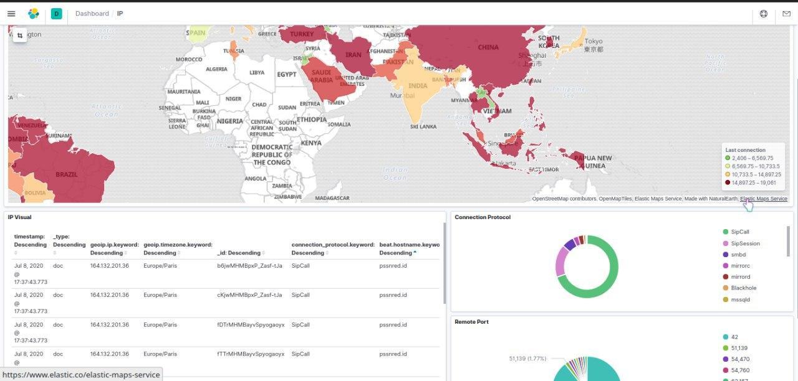
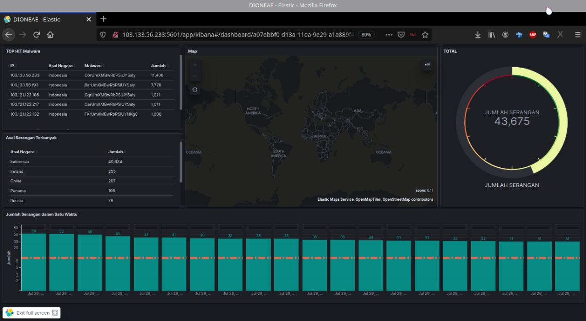
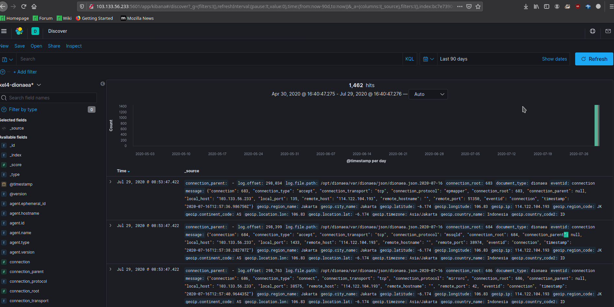

Usage
=====

ELK (Elasticsearch, Logstash dan Kibana)
~~~~~~~~~~~~~~~~~~~~~~~~~~~~~~~~~~~~~~~~

Elasticsearch, Logstash dan Kibana adalah tools yang berguna untuk mengumpulkan log dan juga menvisualisasi atau menampilkan log , Elasticsearch berguna untuk menyimpan semua log yang berasal dari server, Logstash merupakan sebuah perangkat lunak open source untuk mengumpulkan dan memparsing log dan juga membuat index untuk log, kemudian disimpan pada elasticsearch. Kibana adalah web interface yang berguna untuk menampilkan log baik dalam bentuk grafik maupun visualisasi lainnya. untuk file agent di perlukan filebeat yang berguna untuk mengirim log dari setiap server kepada logstash Log yang tersentralisasi sangat berguna jika suatu saat seorang DevOps akan melakukan identifikasi masalah pada server atau aplikasi. Hal tersebut membuat mereka mampu mencari histori data atau log.

Komponen ELK
~~~~~~~~~~~~

Pada praktikum ini dimana membuat bank data terkait malware maka ELK memiliki tugas dan fungsi sebagai berikut:

a. Logstash : memproses log dari malware dan membuat index log malware.
b. Elasticsearch : menyimpan semua log malware.
c. Kibana : Web interface untuk mencari dan memvisualisasikan log malware dalam grafik yang di inginkan.
d. Filebeat : mengirim log ke logstash. Berfungsi sebagai shipping agent untuk log. Menggunakan lumberjack networking protocol untuk berkomunikasi dengan logstash. Filebeat akan dipasang di server yang mempunyai log (yang akan diproses).

Tampilan
~~~~~~~~

Berikut merupakan tampilan dari Kibana dan Log

a. Tampilan Kibana (putih)

b. Tampilan Kibana (hitam)

c. Tampilan Log

